# [PYQUADRANTS](https://pyquadrants-ece1d63f094e.herokuapp.com)

[](https://github.com/craigdickerson725/pyquadrants/commits/main)
[](https://github.com/craigdickerson725/pyquadrants/commits/main)
[](https://github.com/craigdickerson725/pyquadrants)

Welcome to PyQuadrants!  This game is intended to run in the Code Institute mock terminal in Heroku.  As far as I know, I invented this game (though it started out based off of the Gigamic game 'Quantik' and morphed into something totally different).  In this game, players will compete against the computer to gain control over rows, columns, or quadrants.  My idea was to create a game that required strategy, but which is easy to understand by adults and children alike.  Also, the game only takes a few minutes to play, so it is more likely to hold the user's interest until the end (unlike many strategy games).  The instructions are as follows:

### PyQuadrants Instructions

Instructions:

-The game board has four rows, four columns, and four quadrants.

-Rows are the horizontal lines, numbered from left to right.  

-Columns are the vertical lines, numbered from top to bottom.

-Quadrants are the four colored regions.

-The Player's game piece is X, and the Computer's is Y.

-Players take turns placing their respective game pieces on the board.

-The goal is to gain control of as many rows, columns, and quadrants as possible.

-Control is established when a player's game pieces fill at least three of the four available spaces on a row, column, or quadrant.

-Players continue taking turns placing their respective game pieces on the board until there are no more available spaces.

-When there are no more available spaces remaining on the game board, then the game is over, and the player with the most points wins.

Scoring:

-Control is when three of four available spaces on a row, column, or quadrant are represented by one player.  
Control = 1 point

-Complete Control is when all four available spaces of a row, column, or quadrant are represented by one player.
Complete Control = 3 points

Good Luck!

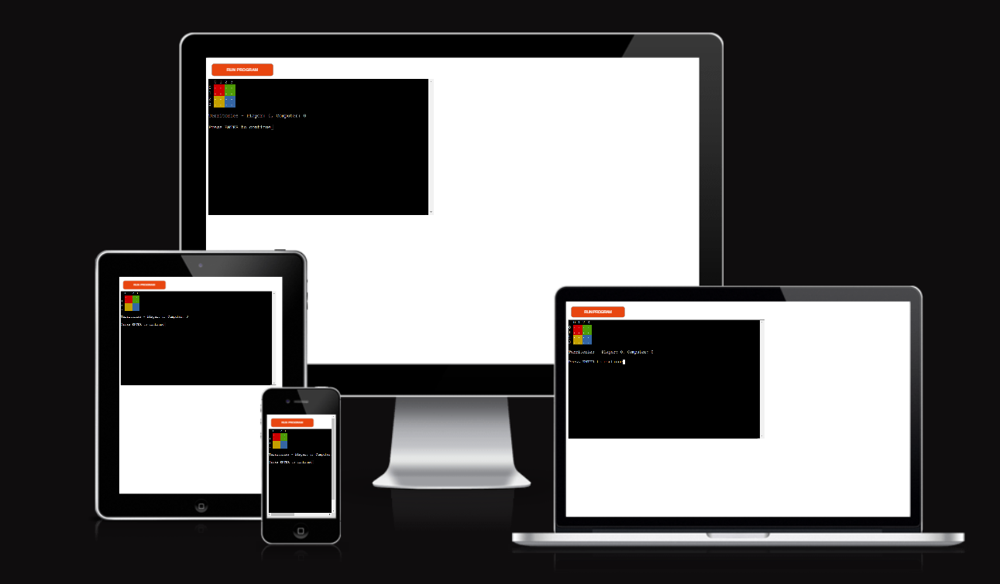

source: [amiresponsive](https://ui.dev/amiresponsive?url=https://pyquadrants-ece1d63f094e.herokuapp.com)

## UX

Being a big fan of both board games and strategy games, I thought I'd tackle creating one myself.  One of the goals was to keep it simple, short, and sweet, so I decided upon a square board with sixteen spaces.  The four spaces in each of the corners (quadrants) are colored, to show that they are each regions of their own.  So altogether, we have:  four rows, four columns, and four quadrants. The user and computer trade turns putting down their respective game pieces until the board is full.

## Features

### Existing Features

- **Colored Game Board**

    - The game board features colors and a clearly marked grid to ensure that the user has a clear understanding of the available moves and territories.

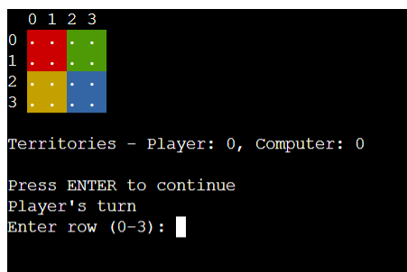

- **Easy to Use Input for Player Moves**

    - The inputs for recording the Player's moves are clear and easy to use.  Simply add the row number and press ENTER, then the column number and press ENTER.  Easy-peasy!

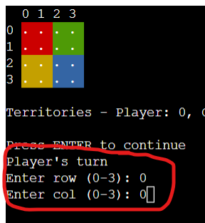

- **Clear Indicator to Show Each Computer Move**

    - After each move by the Computer, the Player can see clearly where the Computer placed its piece.  It is both visible on the game board and written above the board.

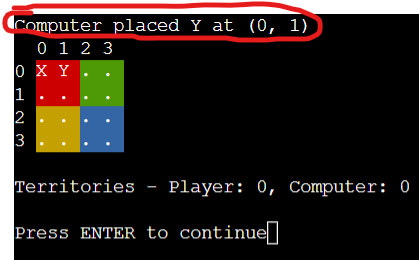

- **Active Score Tracker**

    - There is a score tracker, which the player may refer to at any time to see how many points each participant currently has.

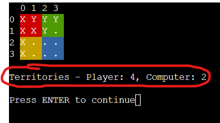

- **End of Game Message With Option to Play Again or Exit**

    - When the game is over, there is a message announcing the winner (or a draw, when applicable), with an option to press Y to start a new game, or to press N to exit the game.

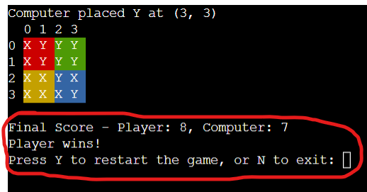

- **Invalid Input Messages**

    - When the Player enters an invalid choice, an Invalid Input Error is given.  This also happens when the Player attempts to place a piece on an already occupied space.

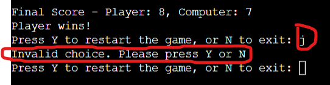

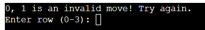

- **Option to View Instructions, Play or Exit Game**

    - Upon starting the program, the Player is given an option to view the complete instructions, so that they may understand how to play the game.  Alternately, the Player may choose the option to Play, or Exit the game.

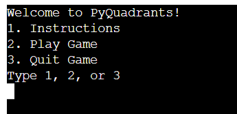

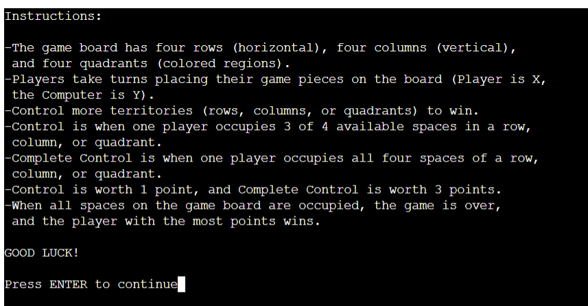

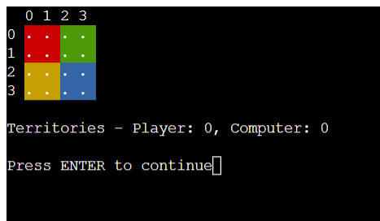

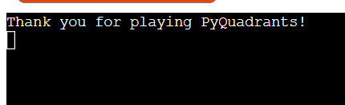

### Future Features

- Player Option to Increase Game Board Size
    - For strategy gamers who have that kind of time on their hands, it would be great to add a 'medium' sized board, which would be four times larger than the normal size.  A 'big' sized board would be sixteen times the normal size--which would be for those extreme gamers!
- Multi-player Capability
    - It would be great to allow friends to play against one another, instead of against the computer.

## Tools & Technologies Used

- [](https://tim.2bn.dev/markdown-builder) used to generate README and TESTING templates.
- [](https://git-scm.com) used for version control. (`git add`, `git commit`, `git push`)
- [](https://github.com) used for secure online code storage.
- [](https://gitpod.io) used as a cloud-based IDE for development.
- [](https://www.python.org) used as the back-end programming language.
- [](https://www.heroku.com) used for hosting the deployed back-end site.
- [](https://chat.openai.com) used to help debug, troubleshoot, and explain things.

## Data Model

### Classes & Functions

The program uses classes as a blueprint for the project's objects (OOP). This allows for the object to be reusable.

```python
class PyQuadrants:
    """ This class defines the game's methods and attributes """
    class PyQuadrants:
    def __init__(self):
        self.reset_game()
        self.colors = {
            'quadrant_1': Back.RED,
            'quadrant_2': Back.GREEN,
            'quadrant_3': Back.YELLOW,
            'quadrant_4': Back.BLUE,
            'endc': Style.RESET_ALL
        }
```

The primary functions used on this application are:

- `__init__(self)`
    - Initializes the game by resetting the board, setting up player information, and defining the colors for each quadrant.
- `reset_game(self)`
    - Resets the game board, player info, and territory scores, preparing the game for a new session.
- `print_board(self)`
    - Prints the current state of the game board, with each quadrant colored according to its position.
- `color_cell(self, row, col, cell)`
    - Colors a specific cell on the board based on its quadrant.
- `is_valid_move(self, row, col)`
    - Checks if a move is valid by ensuring the selected cell is empty.
- `place_piece(self, row, col, piece)`
    -  Places a player's piece on the board and updates the territory scores if the move is valid.
- `update_territories(self, row, col, piece)`
    -  Updates the territory score for the current player based on the latest move, checking rows, columns, and quadrants.
- `score_territory(self, lst, piece)`
    -  Calculates and returns the score for a given row, column, or quadrant based on how many pieces are controlled by the player.
- `player_move(self)`
    -  Handles input from the player for making a move, validating the input and the move.
- `ai_move(self)`
    -  Manages the computer's move by selecting the most effective move based on potential score gain.
- `potential_gain(self, row, col, piece)`
    -  Calculates the potential score gain for a specific move, used by the AI to decide its move.
- `intro(self)`
    -  Displays the introduction screen with options to view instructions, start the game, or quit.
- `instructions(self)`
    -  Provides detailed instructions on how to play the game.
- `play_game(self)`
    -  The main game loop that alternates turns between the player and the computer, checking for the end of the game after each move.
- `end_game(self)`
    -  Manages the end of the game, offering the player a choice to start a new game or exit.
- `clear()`
    -  Clears the terminal screen, keeping the output clean and easy to read.