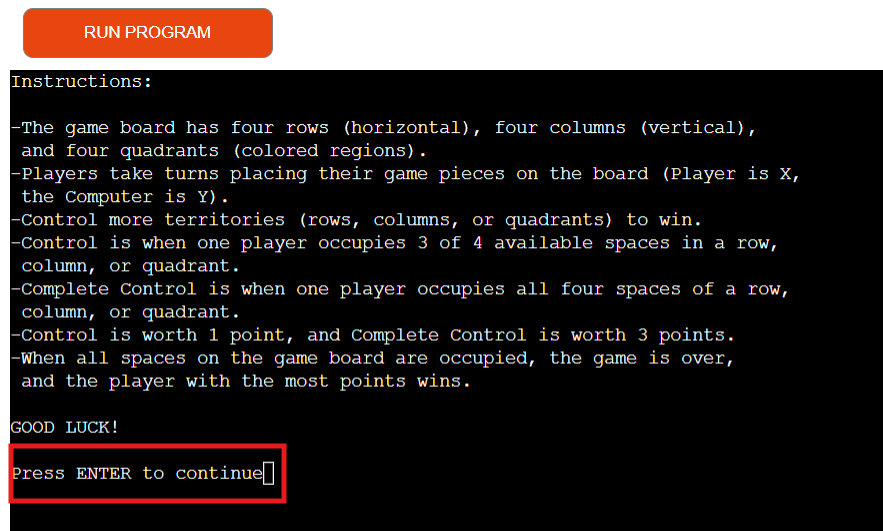

# Testing

> [!NOTE]  
> Return back to the [README.md](README.md) file.

## Code Validation

I manually tested all inputs and functions to make sure that the game operates as intended.  This included:

- The Intro Screen Functionality:

Here the user has three options.  Entering '1' will give the user a look at the full instructions for the game.

Entering '2' will allow the user to play the game.

Entering '3' will allow the user to quit the game. 

Entering anything other than '1', '2', or '3' will give the user an invalid input message.

- Playing the Game

When the game opens, the Player is prompted to go first by entering a valid row and column.

Entering anything other than '0', '1', '2', or '3' will result in an invalid input message.

After the Player makes a valid move, the board is updated and the player can see the move they just made.

When it is time for the Computer to make its move, a message appears to let the Player know that the Computer is moving, followed by printing the board to show the Player where the Computer has moved.

This continues until the game is finished.

During the game, attempting to place a piece on a space that is already occupied will result in an invalid input message.

There is an accurate score tracker which the Player may refer to throughout the course of the game to keep an eye on the score tally.

When all spaces on the board are occupied, the game is over.  At this point, the final score is revealed, and a winner is declared.  The user is also given the option to enter 'Y' to start a new game, or 'N' to quit the program.

Entering anything other than 'Y' or 'N' gives an invalid input message.

Entering 'N' quits the game.

Entering 'Y' starts a new game.

### Python

I have used the recommended [PEP8 CI Python Linter](https://pep8ci.herokuapp.com) to validate all of my Python files.

